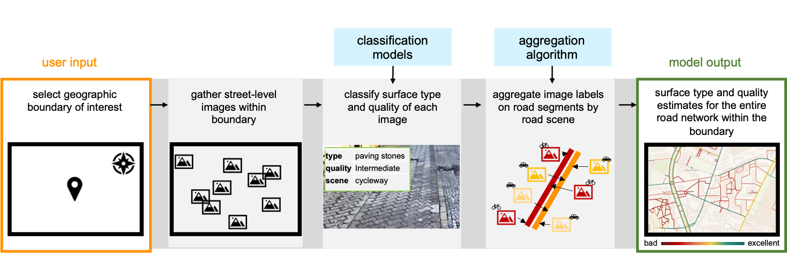

# SurfaceAI: pipeline for surface type and quality classification of road networks

This repository provides the code for the SurfaceAI pipeline.

For a specified bounding box, a Shapfile is generated that contains the surface type and quality classifications on a road network. Therefore, images from Mapillary are downloaded, classified using CNN models and aggregated on a provided (OpenStreetMap) road network.





Find the [paper](https://arxiv.org/abs/2409.18922) of this publication here.

## Getting started

### Prerequisites

- To setup the database, requires prior installation of `postgresql`, `postgis`, `osmosis` (E.g., with `brew install` for MacOS and `apt install` for Linux)

- Download of road network. If OSM is used, as `.pbf` file. Speficy pbf file location in `configs/00_global_config.json` (`pbf_path`).
- Get the model weights from TODO and store them in the subfolder `models` or specify the respective folder location in `configs/00_global_config.json` (`model_root`).

### User Input

#### Quick Start (TL;DR)

Use the `configs/01_area_of_interest_example.json` as a template and specify attributes `name` (str), `minLon`, `minLat`, `maxLon`, `maxLat` of the bounding box of your area of interest.

Execute the pipeline with `python src/main.py -c 01_area_of_interest_example` 

The created dataset is stored in `data/<NAME_FROM_CONFIG>_surfaceai.shp`

#### Details

The configuration files are constructed to provide one global configuration file that sets parameters regardless of the specific area of interest. For each area of interest, defined by its geographical bounding box, another specific config file is created. This allows you to speficy multiple area of interest. Within the specific configuration file, you may overwrite any global parameter. The `00_global_config.json` is always considered, while you specify the specific area of interest config file when starting the program: `python src/main.py -c my_config_file` 


- Specify the the bounding box (`minLon`, `minLat`, `maxLon`, `maxLat`) of the region of interest in `configs/your_config.json` file and provide a `name`
- If you want to use a different road network than OSM, add a table with LINESTRINGs to your PostGIS database, within your config, set the parameter `pbf_path=None` and adjust the parameter `"custom_attrs":{"edge_table_name": "SQL_TABLE_NAME"},`

- In `00_global_config.json` a set of global config parameters that are all set to defaults do not require change (but may be adjusted)
They consist of the following: 
    - Database keys for `dbname`, `dbuser`, `dbhost` and `dbpassword` as specified in `02_credentials.json`
    - Mapillary API specifications: 
        - `img_size`indicates the size of the Mapillary image to download, given by the image width. Options according to the Mapillary API: `thumb_original_url`, `thumb_2048_url`, `thumb_1024_url`, `thumb_256_url`
        - `parrallel`(bool), whether image download should be parallelized
        - `parallel_batch_size`maximum images to download in parallel
    - Geospatial operation parameters:    
        - `proj_crs`: EPSG code of projected CRS to use for distance computations (for areas of interest in Europe 3035 is suitable)
        - `dist_from_road`: maximum distance from road in CRS unit (usually meters) for an image to be assigned to the road,
        - `segment_length`: length of a subsegment for aggregation algorithm,
        - `min_road_length`: short roads, which are common in OSM, like driveways, can be excluded to reduce cluttering and noise. This parameter specifies the minimum road length to be included.
        - `segments_per_group`: deprecated
    - Classification model specific parameters:
        - `model_root`: path to root folder of models
        - `models`(dict): required keys: `road_type`, `surface_type`, `surface_quality`(with sub keys `asphalt`, `concrete`, `paving_stones`, `sett`, `unpaved`). Each value indicates the pt. file of the respective weights 
        - `gpu_kernel`: if more than one GPU kernel is available, the one to be used can be specified here
        - `transform_surface` and `transform_road_type` (dict): with keys `resize`and `crop`specifying the transform operations conducted on images for these modelse
        - `batch_size`model batch size

You can overwrite any paramter in the specific config. E.g., the `dist_to_road`shall be 10 meters for all area of interest, except one, then you can overwrite the parameter by setting `dist_to_road` within the specific config as well with the desired parameter.

### Run SurfaceAI

Using [`poetry`](https://python-poetry.org/) for dependency management, install poetry: 

```bash 
    pipx install poetry
```

Create an environment using poetry

```bash 
    poetry shell
```

Install required packages, as defined in `pyproject.toml`

```bash 
    poetry install
```


Start the pipeline by running:

```bash
    python src/main.py  -c CONFIG_NAME
```

The created dataset is stored in `data/<NAME_FROM_CONFIG>_surfaceai.shp`

## Implementation details

### Pipeline:


- setup Postgres database with PostGIS and osmosis extension
- query all image metadata within the provided bounding box from Mapillary and write to database
- create 20m subsegments of road segments within the bounding box (based on OSM if no other network is provided)
- match images to closest road, max. 10m distance (may be adjusted in the `config`)
- download all relevant images from Mapillary (depending on the number of images, this step may take a while)
- classify all road scene, surface type and quality of images (currently, this step is not yet integrated in this pipeline)
- aggregate single classifications to road network classification (see details below)
- store Shapefile of results

### Surface classification 

See https://github.com/SurfaceAI/classification_models

### Aggregation algorithm 

The aggregation algorithm runs as follows:

- aggregate images on 20m subsegments; only use images that are either not within the vicinity of another road (part) or where the road scene classification matches the road type of the segment
    - surface type: majority vote
    - surface quality: average
- aggregate all subsegments on road segment
    - surface type: majority vote (if tied, also use image counts)
    - surface quality: average
- futher attributes that are created per road segment:
    - min. and max. capture date of considered images
    - image count
    - confidence score of surface type (*share of subsegments consistent with predicted type multiplied by share of images consistent with predicted type*)


